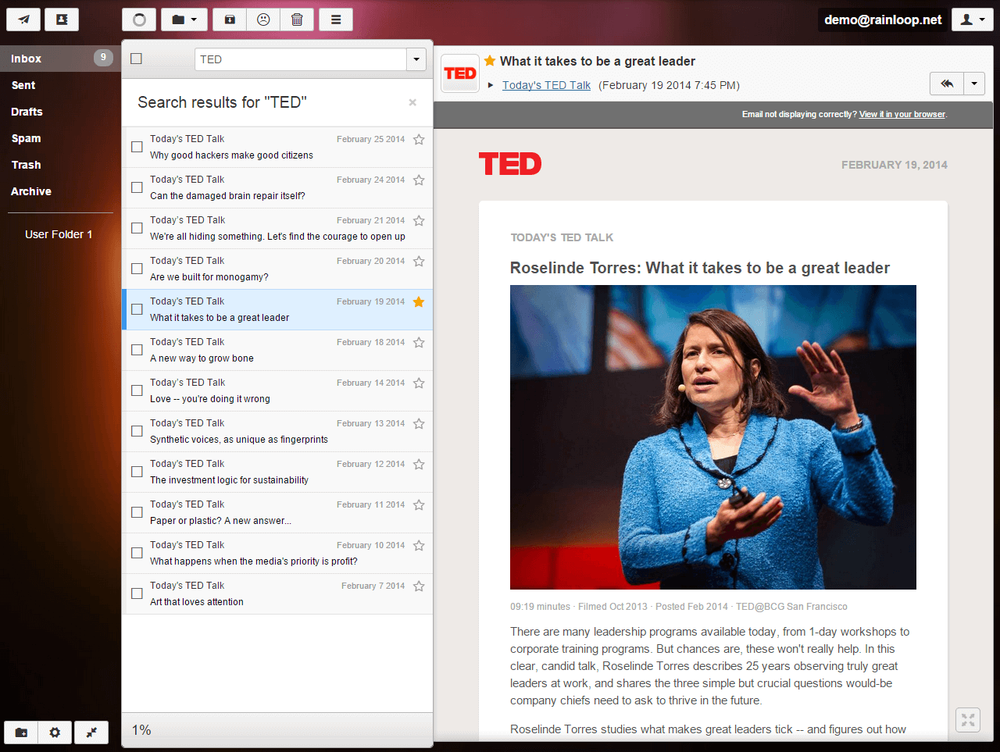

# Rainloop pour YunoHost

[](https://dash.yunohost.org/appci/app/rainloop)    
[](https://install-app.yunohost.org/?app=rainloop)

*[Read this readme in english.](./README.md)*
*[Lire ce readme en français.](./README_fr.md)*

> *Ce package vous permet d'installer Rainloop rapidement et simplement sur un serveur YunoHost.
Si vous n'avez pas YunoHost, regardez [ici](https://yunohost.org/#/install) pour savoir comment l'installer et en profiter.*

## Vue d'ensemble

Lightweight multi-account webmail

### Features

- Modern user interface.
- Complete support of IMAP and SMTP protocols including SSL and STARTTLS.
- Sieve scripts (Filters and vacation message).
- Direct access to mail server is used (mails are not stored locally on web server).
- Allows for adding multiple accounts to primary one, simultaneous access to different accounts in different browser tabs is supported. Additional identities.
- Administrative panel for configuring main options.
- Integration with Facebook, Google, Twitter and Dropbox.
- Managing folders list.
- Configurable multi-level caching system.
- Extending functionality with plugins installed through admin panel.
- Perfect rendering of complex HTML mails.
- Drag'n'drop for mails and attachments.
- Keyboard shortcuts support.
- Autocompletion of e-mail addresses.


**Version incluse :** 1.16.0~ynh2

**Démo :** https://mail.rainloop.net/

## Captures d'écran



## Avertissements / informations importantes

## Access to admin panel

To access admin panel, use URL of the following kind: http://product_installation_URL/app/?admin

For example: http://webmail.domain.com/app/?admin

Default login is `admin`, the password is the one you chose during installation. 
## Documentations et ressources

* Site officiel de l'app : https://www.rainloop.net/
* Documentation officielle de l'admin : https://www.rainloop.net/docs/configuration/
* Dépôt de code officiel de l'app : https://github.com/RainLoop/rainloop-webmail
* Documentation YunoHost pour cette app : https://yunohost.org/app_rainloop
* Signaler un bug : https://github.com/YunoHost-Apps/rainloop_ynh/issues

## Informations pour les développeurs

Merci de faire vos pull request sur la [branche testing](https://github.com/YunoHost-Apps/rainloop_ynh/tree/testing).

Pour essayer la branche testing, procédez comme suit.
```
sudo yunohost app install https://github.com/YunoHost-Apps/rainloop_ynh/tree/testing --debug
ou
sudo yunohost app upgrade rainloop -u https://github.com/YunoHost-Apps/rainloop_ynh/tree/testing --debug
```

**Plus d'infos sur le packaging d'applications :** https://yunohost.org/packaging_apps