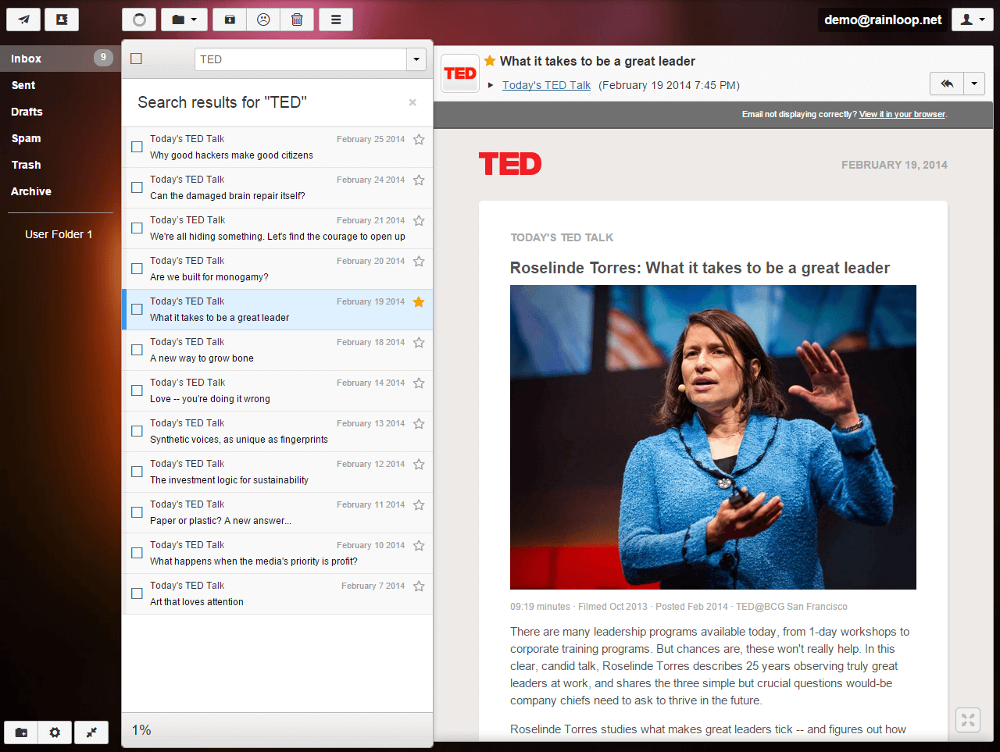

<!--
N.B.: Questo README è stato automaticamente generato da <https://github.com/YunoHost/apps/tree/master/tools/readme_generator>
NON DEVE essere modificato manualmente.
-->

# Rainloop per YunoHost

[](https://dash.yunohost.org/appci/app/rainloop)  

[](https://install-app.yunohost.org/?app=rainloop)

*[Leggi questo README in altre lingue.](./ALL_README.md)*

> *Questo pacchetto ti permette di installare Rainloop su un server YunoHost in modo semplice e veloce.*  
> *Se non hai YunoHost, consulta [la guida](https://yunohost.org/install) per imparare a installarlo.*

## Panoramica

Lightweight multi-account webmail

### Features

- Modern user interface.
- Complete support of IMAP and SMTP protocols including SSL and STARTTLS.
- Sieve scripts (Filters and vacation message).
- Direct access to mail server is used (mails are not stored locally on web server).
- Allows for adding multiple accounts to primary one, simultaneous access to different accounts in different browser tabs is supported. Additional identities.
- Administrative panel for configuring main options.
- Integration with Facebook, Google, Twitter and Dropbox.
- Managing folders list.
- Configurable multi-level caching system.
- Extending functionality with plugins installed through admin panel.
- Perfect rendering of complex HTML mails.
- Drag'n'drop for mails and attachments.
- Keyboard shortcuts support.
- Autocompletion of e-mail addresses.


**Versione pubblicata:** 1.17.0~ynh1

**Prova:** <https://mail.rainloop.net/>

## Screenshot



## Attenzione/informazioni importanti

## Rainloop is unmaintained ⚠️

See https://github.com/RainLoop/rainloop-webmail/issues/2162

## Access to admin panel

To access admin panel, use URL of the following kind: http://product_installation_URL/app/?admin

For example: http://webmail.domain.com/app/?admin

Default login is `admin`, the password is the one you chose during installation. 

## :red_circle: Anti-funzionalità

- **Cattiva reputazione di sicurezza**: Ha una cattiva reputazione in termini di sicurezza (per esempio, potrebbe utilizzare addon obsoleti).
- **Applicazione non mantenuta**: Questo software non è più mantenuto. Ci si può aspettare che con il passare del tempo smetta di funzionare, sia esposto a falle di sicurezza, ecc.
- **Sostituita da un’altra app**: Quest’app è stata sostituita da un’altra app. Fare riferimento al file “README”.

## Documentazione e risorse

- Sito web ufficiale dell’app: <https://www.rainloop.net/>
- Documentazione ufficiale per gli amministratori: <https://www.rainloop.net/docs/configuration/>
- Repository upstream del codice dell’app: <https://github.com/RainLoop/rainloop-webmail>
- Store di YunoHost: <https://apps.yunohost.org/app/rainloop>
- Segnala un problema: <https://github.com/YunoHost-Apps/rainloop_ynh/issues>

## Informazioni per sviluppatori

Si prega di inviare la tua pull request alla [branch di `testing`](https://github.com/YunoHost-Apps/rainloop_ynh/tree/testing).

Per provare la branch di `testing`, si prega di procedere in questo modo:

```bash
sudo yunohost app install https://github.com/YunoHost-Apps/rainloop_ynh/tree/testing --debug
o
sudo yunohost app upgrade rainloop -u https://github.com/YunoHost-Apps/rainloop_ynh/tree/testing --debug
```

**Maggiori informazioni riguardo il pacchetto di quest’app:** <https://yunohost.org/packaging_apps>
